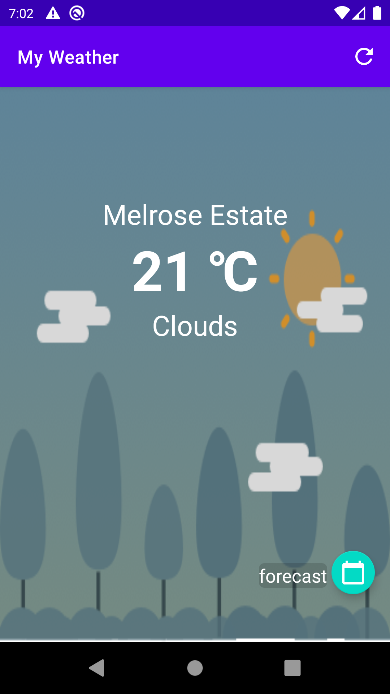
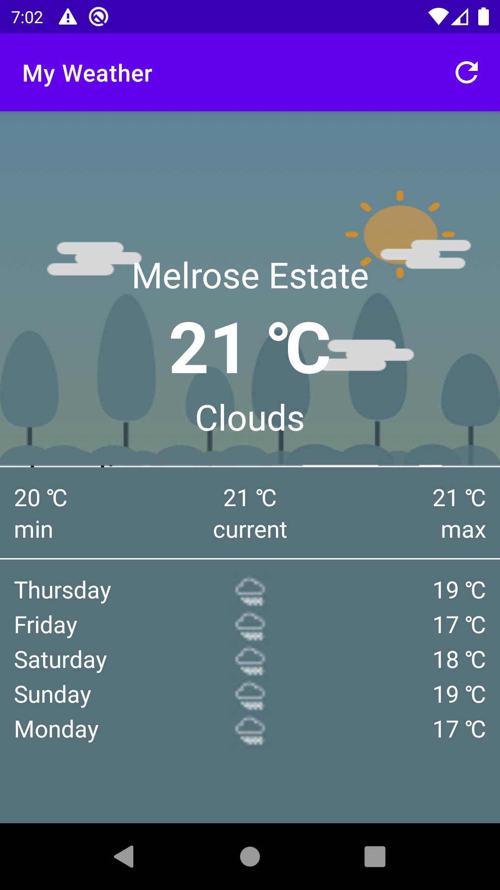

# My-Weather
A simple weather App that provide weather and forecast based on the user's location.

    Technology used {

        - Kotlin
        - Coroutine Flow
        - Hilt
        - MVVM
        - Mockito for Unit testing.
        - Travis for CI
    }

See image below for example:

